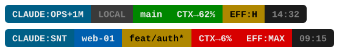

# claude-statusline

A configurable status bar for [Claude Code](https://claude.ai/code) that shows model, context, git state, context-window headroom, reasoning effort, and time in a persistent visual segment bar.



The layout is `FE:MODEL · CONTEXT · GIT · CTX · EFFORT · TIME`. Segment colors shift with state: git turns amber when dirty, `CTX` and `EFF` warm up (green → amber → red) as you approach a limit.

---

## Features

- **Model segment** — active model short name (`SNT`/`OPS`/`HKU`) plus a `+1M` flag for 1M-context models. The label before the colon defaults to `CLAUDE` but can be driven per-session (see [Frontend label](#frontend-label)).
- **Context segment** — a mapped host alias, or an active working path, falling back to `LOCAL`.
- **Git segment** — branch name (truncated to 12 chars), dirty indicator `*` (amber), ahead/behind counts in debug mode.
- **CTX segment** — approximate headroom before auto-compact (`CTX→N%`). See [Context window](#context-window-auto-compact-countdown).
- **Effort segment** — current reasoning effort (`EFF:L/M/H/XH/MAX`), shown only when the model supports it.
- **Time segment** — current `HH:MM` in ops/debug modes.
- **Three styles** — `blend` (default, ▌ half-block color fusion), `flat` (spaced blocks), `powerline` (▶ arrows). No Nerd Font required for any style.
- **Three modes** — `focus` (minimal), `ops` (default), `debug` (+ CWD).

---

## Requirements

- Bash 4+ (macOS ships Bash 3 — install via `brew install bash` or use the system `sh`)
- `jq` — for parsing Claude Code's JSON input
- `git` — for branch/dirty detection
- Claude Code with statusLine support

---

## Installation

```bash
git clone https://github.com/clouitreee/claude-statusline.git
cd claude-statusline
bash install.sh
```

The installer:
1. Copies `statusline.sh` to `~/.claude/statusline.sh`
2. Patches `~/.claude/settings.json` with the statusLine command
3. Backs up any existing files before overwriting

### Manual installation

```bash
cp statusline.sh ~/.claude/statusline.sh
chmod +x ~/.claude/statusline.sh
```

Then add to `~/.claude/settings.json`:

```json
{
  "statusLine": {
    "type": "command",
    "command": "bash ~/.claude/statusline.sh"
  }
}
```

---

## Configuration

All configuration is done via environment variables — no config files, no edits to the script.

Add these to your shell profile (`~/.zshrc`, `~/.bashrc`, etc.):

### Style and mode

```bash
export CLAUDE_SL_STYLE=flat             # blend (default) | flat | powerline
export CLAUDE_STATUSLINE_MODE=focus     # focus | ops (default) | debug
```

| Mode | Segments shown |
|------|---------------|
| `focus` | FE:MODEL, CONTEXT, GIT, CTX, EFFORT |
| `ops` | FE:MODEL, CONTEXT, GIT, CTX, EFFORT, TIME |
| `debug` | FE:MODEL, CONTEXT, GIT, CTX, EFFORT, TIME, CWD, git ahead/behind |

### Server host mapping

Map your server hostnames to short aliases. The matched alias appears in the context segment, so a Claude Code session running over SSH on a known host is recognizable at a glance.

```bash
# Single server
export STATUSLINE_HOST_MAP="myserver=PROD"

# Multiple servers
export STATUSLINE_HOST_MAP="web-01=PROD db-01=PROD devbox=DEV staging=STAGE"
```

Without any mapping, hosts show as `LOCAL`.

### Active path

When the host is `LOCAL`, the context segment can show a short label read from a per-session file: `~/.claude/.active_path-<session_id>` (whitespace-trimmed), where `<session_id>` is the `session_id` field Claude Code passes on stdin — stable and unique for the lifetime of a session. This is meant to be written by a hook — for example a `PreToolUse` hook that records which project or area the session is currently working in. A ready-to-use example hook is in [`examples/track-active-path.sh`](examples/track-active-path.sh).

If no session-scoped file exists yet, the statusline falls back to the legacy shared `~/.claude/.active_path` (pre-`session_id` versions of this tool); if neither exists, the segment shows `LOCAL`.

```bash
# example: a hook writes the current area into a file scoped to its own session
SESSION_ID=$(echo "$HOOK_INPUT" | jq -r '.session_id')
echo "billing-api" > ~/.claude/.active_path-"$SESSION_ID"
```

> **Why per-session, not one shared file:** a single `~/.claude/.active_path` is shared by *every* Claude Code session open at once. A `PreToolUse` hook fires per-session, so with a shared file, a tool call in one terminal tab silently overwrites what every other open session's statusline displays — the label you see can belong to a completely different project. Namespacing by `session_id` isolates each session's state; see [`examples/track-active-path.sh`](examples/track-active-path.sh) for the reference implementation, including an opportunistic cleanup pass for files left behind by closed sessions.

### Context window (auto-compact countdown)

The `CTX` segment approximates Claude Code's "% until auto-compact" badge. Claude Code does **not** expose that exact number to the statusline, so it is derived from `context_window.remaining_percentage` minus a reserved buffer (the output reservation plus safety margin Claude Code keeps before it compacts):

```
CTX→N%  =  remaining_percentage − STATUSLINE_COMPACT_RESERVE
```

```bash
export STATUSLINE_COMPACT_RESERVE=16    # percentage points (default: 16)
```

- Colors: green at `≥25`, amber at `10–24`, red below `10`.
- Set `STATUSLINE_COMPACT_RESERVE=0` to show the true free-context percentage instead of the countdown.
- This is an approximation. The real auto-compact threshold is internal to Claude Code, and the buffer expressed in percentage points shifts if the context window size changes (200k vs 1M), since the underlying reservation is a fixed token count. Recalibrate the reserve for the window size you actually run.

### Reasoning effort

The `EFF` segment is automatic and needs no configuration. It reads the live effort level from the statusline JSON (`effort.level`), falling back to `effortLevel` in `~/.claude/settings.json`. It is hidden for models that do not support the effort parameter.

### Frontend label

The label before the model name (`CLAUDE:OPS`) defaults to `CLAUDE`. Three ways to set it, checked in this order:

1. **`CLAUDE_LAUNCH_ALIAS` environment variable** — set by the shell function that launches Claude Code, inherited per-process. **Recommended** when you run more than one launch alias concurrently (e.g. a plain `claude` and an `ops`/`clobs`-style alias in different tabs): each session gets its own value, correctly isolated, no shared state.

   ```bash
   # in a shell wrapper function, before exec'ing claude
   ops() {
     export CLAUDE_LAUNCH_ALIAS="ops"
     command claude "$@"
   }
   ```

2. **`~/.claude/.launch_context`** (whitespace-trimmed, uppercased) — fallback for callers that can't set an env var before launch:

   ```bash
   echo "ops" > ~/.claude/.launch_context  # shows as: OPS:OPS
   ```

   ⚠️ Unlike active-path tracking above, this file **cannot** be namespaced by `session_id` — a launch alias is chosen by the shell *before* Claude Code starts and is assigned a session ID, so no session-scoped key exists yet at that point. The file is shared by every concurrently open session: whichever alias launched most recently wins and relabels every other open session's statusline until it's relaunched. If you only ever run one launch alias at a time, this is harmless; if you regularly run several at once, use `CLAUDE_LAUNCH_ALIAS` instead.

3. **`STATUSLINE_FE_NAME`** environment variable — static default used only when neither of the above is set.

   ```bash
   export STATUSLINE_FE_NAME="ACME"        # shows as: ACME:OPS
   ```

---

## Examples

### DevOps / multi-server setup

```bash
# ~/.zshrc
export STATUSLINE_HOST_MAP="web-01=PROD web-02=PROD db-primary=DB staging=STAGE"
export CLAUDE_SL_STYLE=powerline
```

Result on web-01: ` CLAUDE:SNT  PROD  main  CTX→48%  EFF:M  09:15 `

### Tighter auto-compact warning

```bash
# warn earlier — treat a bigger slice as reserved
export STATUSLINE_COMPACT_RESERVE=22
```

### Focus mode (minimal)

```bash
export CLAUDE_STATUSLINE_MODE=focus
```

Result: ` CLAUDE:SNT  LOCAL  main  CTX→62%  EFF:H `

---

## Advanced customization

The `examples/` directory contains a fuller, self-contained variant you can adopt or borrow from:

| File | Description |
|------|-------------|
| `examples/msp.sh` | An independent MSP / multi-server variant with its own segment set (server aliases, vault-area detection, goal progress from a markdown file, a LIVE/SAFE state segment, TTL-cached file reads). It is a separate example layout, not a drop-in mirror of the main `statusline.sh`. |
| `examples/track-active-path.sh` | Reference `PreToolUse` hook for the [Active path](#active-path) segment — writes a per-`session_id` file so concurrent sessions don't overwrite each other's label. |

To use an example as your statusline:

```bash
cp examples/msp.sh ~/.claude/statusline.sh
```

### Writing your own extension

The script is designed to be easy to fork. Key extension points:

**Add a custom segment** — append it wherever you like after the segment arrays are initialized:

```bash
add_seg "MYDATA" $C_BLUE $C_WHITE
```

`add_seg TEXT BG_COLOR_256 FG_COLOR_256` pushes a segment with a 256-color background and foreground; the renderer handles the blend/flat/powerline transitions for you.

**Read a value from the JSON input** — the full Claude Code statusline payload is in `$INPUT`:

```bash
SESSION=$(printf '%s' "$INPUT" | jq -r '.session_name // empty')
[ -n "$SESSION" ] && add_seg "$SESSION" $C_DARK $C_GRAY
```

---

## Troubleshooting

**Statusline not appearing:**
- Check `~/.claude/settings.json` contains the `statusLine` key
- Run `bash ~/.claude/statusline.sh </dev/null` manually — should output a colored line
- Verify `jq` is installed: `jq --version`

**CTX number doesn't match the "% until auto-compact" badge:**
- Expected. The badge is internal Claude Code state and is not exposed to the statusline; `CTX` approximates it (see [Context window](#context-window-auto-compact-countdown)). Tune `STATUSLINE_COMPACT_RESERVE` for your window size.

**Colors look wrong:**
- Your terminal must support 256 colors: `echo $TERM` should show `xterm-256color` or similar
- If using tmux, add `set -g default-terminal "screen-256color"` to `~/.tmux.conf`

**Powerline arrows look broken:**
- The `▶` character (U+25B6) is a standard Unicode block — no Nerd Font needed
- If it renders as a box, your terminal font may lack this codepoint; switch to `flat` style

**Slow statusline:**
- The git operations (`git status`, `git branch`) run on every render
- For large repos, consider setting `CLAUDE_STATUSLINE_MODE=focus`
- The `examples/msp.sh` variant uses a TTL cache for expensive file reads

---

## License

MIT
